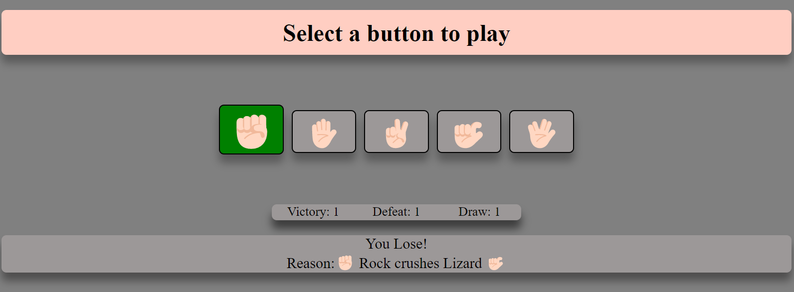

# Game : Rock, Paper, Scissor, Lizzard, Spock

It has a following features.
1. Pattern Identification
2. Score Tracking
3. Ability to play against Coputer

The logic used behind this game are following.
1. Scissors cuts Paper
2. Paper Covers Rock
3. Rock crushes Scissors
4. Rock crushes Lizard
5. Lizard poisons Spock
6. Spock smashes Scissors
7. Lizard eats Paper
8. Spock vaporizes Rock
9. Scissors decapitates Lizard
10. Paper disproves Spock

### Reference
1. YouTube tutorial-Coding Rock Paper Scissors Lizard Spock Game (ASMR Programming) by coding Therapy